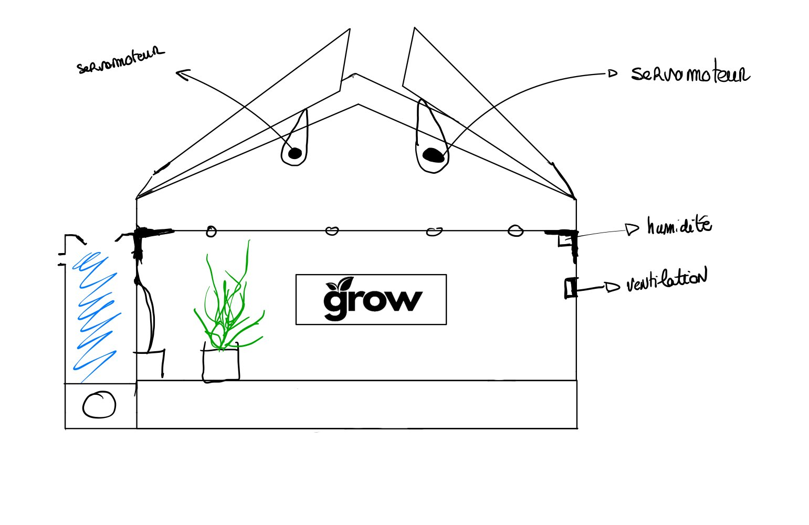

# Conception et prototypage

Ci-dessous, un premier schéma de GROW. Notre serre est similaire à une petite maison, avec un toit qui s'ouvre en deux grâce à deux servomoteurs. Elle est équipée :
Nous avons installé un serveur Node-RED, un serveur MQTT et un phpMyAdmin sur une VM Ubuntu pour :
* récupérer les données d'OpenWeatherMap,
* communiquer et récupérer les données de notre ESP32,
* avoir un historique des données et un dashboard de la ville d'Amiens,
* avoir un historique des données et un dashboard de la serre

