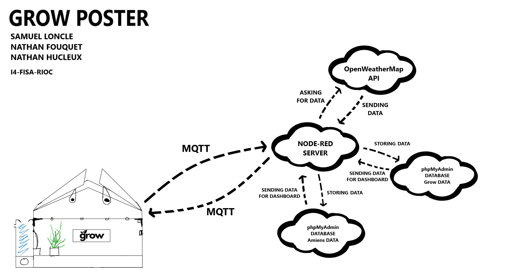

# Bienvenue sur notre documentation

Bienvenue dans la documentation du projet GROW. Ce site a pour but de fournir toutes les informations nécessaires pour comprendre, utiliser et reproduire efficacement notre projet.

## À propos du Projet

Décrivez ici en quelques lignes l'objectif et l'aperçu général de votre projet. Quel est son but ? À qui est-il destiné ? Quels problèmes cherche-t-il à résoudre ?

Aujourd'hui, de nombreuses personnes souhaitent se mettre au jardinage ou à l'entretien de plantes. Les citadins, habitant par définition en ville, ont très souvent peu d'espace pour cultiver des légumes ou faire pousser des plantes.

Pour répondre à ce besoin de plus en plus grandissant, nous avons réfléchi à une solution qui pourrait allier à la fois le jardinage et les petits espaces.
GROW est une serre connectée intelligente, conçue dans le cadre de notre projet de fin de 4ème année d'école d'ingénieurs en réseaux informatiques et objets connectés. Cette serre a pour objectif de permettre aux personnes habitant dans des appartements de faire du jardinage à petite échelle sur le balcon, la terrasse ou même chez eux.

## Poster

---
