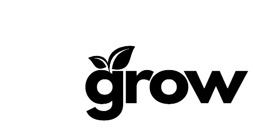
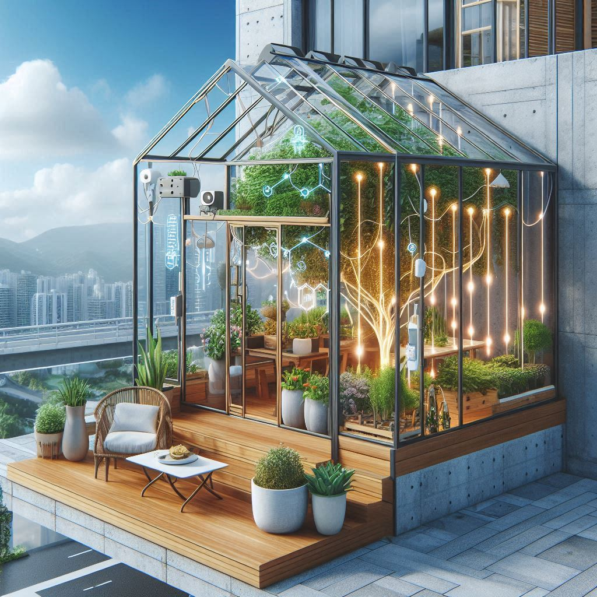

# Bienvenue sur notre documentation

Bienvenue dans la documentation du projet GROW. Ce site a pour but de fournir toutes les informations nécessaires pour comprendre, utiliser et reproduire efficacement notre projet.

## À propos du Projet

Décrivez ici en quelques lignes l'objectif et l'aperçu général de votre projet. Quel est son but ? À qui est-il destiné ? Quels problèmes cherche-t-il à résoudre ?
Le but de ce projet est d'avoir une serre qui va s'adapter aux conditions climatiques de son environnement.
Afin de recueillir les données climatiques de l'endroit où est située la serre, nous utilisons OpenWeatherMap, qui est capable de nous donner une température, un pourcentage d'humidité, voire même l'état du temps par rapport à une ville.
Sont croisées avec les données d'OpenWeatherMap les données de la serre, obtenues grâce à une carte ESP32, elle-même couplée à un capteur DTH11 (capteur d'humidité et de température) et à un servomoteur.

## Poster

Ici vous publierez le poster de votre projet.

## Vidéo

Ici vous publierez la vidéo de votre projet. 
- Moins de 1min30
- Présentation du projet 
- Des explication du fonctionnement du projet
- Des vues du projet / Prototype / Application etc... 
- Des plans du fonctionnement (même basique ou des éléments séparés)
- Une conclusion
Si en stockage local : >50mo

<video src="images/intro_amiens.mp4" controls title="Title"  style="width: 100%;"></video>

---
